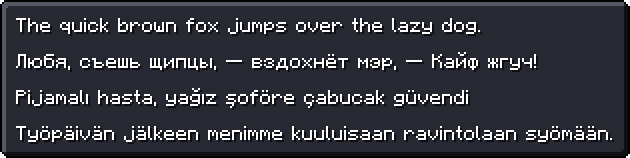
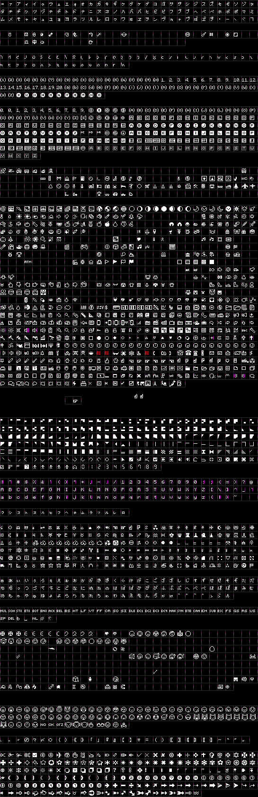
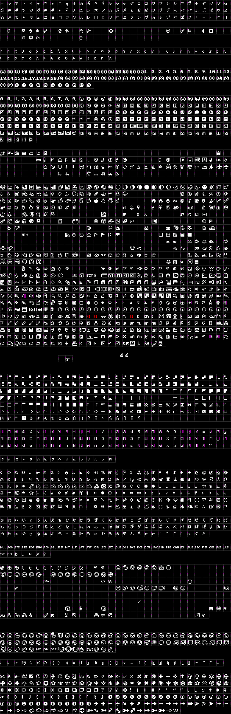

	

## fonts
> 
>  
> these fonts are incompetently made, so expect some issues!!
> 
> feel free to let me know in Issues page if you have issue or suggestion with these packages `:)`
>
> also!!! this project isn't affiliated with Mojang nor Microsoft in any way!

for downloads, check [Releases page](https://github.com/macimas-fonts/macsMinecraft/releases)

 
*→ Minecraft font with bold and italic styles*

this is most likely what you're looking for!
 
containing **2410** characters, it should cover almost every character in respect to Minecraft Java 1.20.4

	
previews

	some sample text
	 
	
	

	bold and italic styles, with bold being strange as ever
	 
	
	

	a boring little story
	 
	
	

	some goofy thing i wrote for some odd reason
	 
	

	
glyph table

	Regular
	 
	
	 
	Bold
	 
	

 
*→ tweaks characters in Main font*

tweakity some characters, and tries to make Bold style more readable
 
made with my personal taste. let me know if bad in Issues page

	
previews

	tweaks some things, i guess..
	 
	
	

	bold style should be more readable
	 
	
	

	some characters will not be bolden in bold style, for reasons!
	 
	

	
glyph table

	Regular
	 
	
	 
	Bold
	 
	

 
*→ adds more characters to Main font*

a very rough attempt. currently adds around **1500+** characters
 
i'm relatively unsure what to think of it. a lot of characters dont look good with the default line spacing and some look strange and goofy

	
previews

	a little arrowy and sparkly preview, with (most likely) bonked Shavian sentence
	 
	
	 
	please note that some characters aren't built properly due to the converter i use. it does provide a fix but filesize triples and im too stubborn, so yeah. i dont realy care for now since you probably dont really need to use these fonts anyway
	 
	
	 
	an attempt to do emoticons
	 
	

	
glyph table

	Regular
	 
	
	 
	Bold
	 
	

 
*→ simply Main + Tweaked + Extended fonts*

quick n dirty font that combines the other fonts

	
previews

	refer to their dedicated sections

	
glyph table

	Bold
	 
	

 
*→ it's that secret font in Java and the runic font in Dungeons*

yep!

	
previews

	the fonts! with Main fonts for comparison
	 
	

	
glyph table

	Regular
	 
	
	 
	Bold
	 
	

 
*→ simply bold more readable*

yep!

	
previews

	bold is most likely more readable, maybe
	 
	

	
glyph table

	Bold
	 
	

## license
fonts are under [SIL Open Font License](./LICENSE)

feel free and open source to use these fonts freely for personal and commercial purposes! `:D`

## kudos
- used [YellowAfterlife's pixel font converter](https://yal.cc/r/20/pixelfont) for making the base fonts
- used [ezgif](https://ezgif.com) for making animated previews
- lastly, thanks [Minecraft](https://www.minecraft.net) for existing

## least freqently asked questions

### Why did you make this?
ah well, back around December 2022 i was trying to find a Minecraft font that i could use for one of my things. there were several fonts, but they were either not pixel-perfect, outdated, or were quite lacking or weird looking.

a normal person would have chosen the most convenient font to use, but i am kind of a nitpicky person, and i am not a normal person (i think)

so instead i decided to make my own pixel font!!! i used this [pixel font converter](https://yal.cc/r/20/pixelfont/) that uses images to make fonts and thought it was very cool

the very first version contained Basic Latin and some other characters i needed. was pretty satisfied with it and kept it as is for an entire year, until i revisited the font a year later in December 2023

was pretty bored in christmas break and thought "wat if i make a mc font that's 1:1 used ingame for funsies"

"no way in hell i'm gonna be able to do that" i said, but tried anyway, making this probably my most ambitious project ever

also this was previously released as "mdt's Minecraft", but decided to rename it and release it as separate font for terrible reasons `:v` the previous version is still up in the `fonts` repo, but i'd rather not you find it `>:(`

### What are your plans for this?
uhhh i dont really have any plans. i'm just going along with whatver i think and would like to work on

### How do I contribute/add and tweak characters?
uhmmmmm i'm not sure. i never really thought about other people contributing in mind, i just wanted to make smth for myself

i guess you could probably suggest or make characters in Issues page and i might add them

### How do I generate fonts?
uhmmm not sure why you need to do that but here's some prerequisites:

- Linux (not sure if it works on Windows)
- Python
- FontForge 

then run the script `python generate.py`
 
it should put generated fonts in `TEMP/`

if it doesnt work, well that's too bad!

### Your process for developing and generating fonts are stupid.
haha sorry, i think it's the most convenient for me and i'm not particularly good at programming

also i don't think that's a question

### Why do you not properly capitalize your sentences?
personal preference

### What's with the dirt block icon?
oh haha it's just a little drawing i did. his name is Bennett
 
say hi to him `:D`