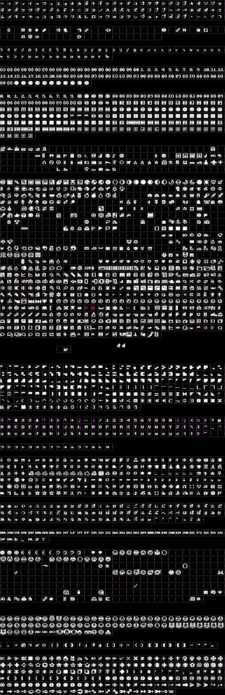

<h1 align="center">
	
	 
	mac's Minecraft
</h1>

	a rough 1:1 recreation of the Minecraft font
	 
	<small>kudos to <a href="https://yal.cc/r/20/pixelfont">YellowAfterlife's pixel font converter</a></small>

## fonts

> 
>  
> these fonts are incompetently made, so expect some issues!!
> 
> feel free to let me know in Issues page if you have issue or suggestion with these packages `:)`

for downloads, check [Releases page](https://github.com/macimas-fonts/macsMinecraft/releases)

 
*→ Minecraft font with bold and italic styles*

this is most likely what you're looking for!
 
it should cover almost every character in respect to Minecraft Java 1.20.4

	
previews

	some sample text
	 
	
	

	bold and italic styles, with bold being strange as ever
	 
	
	

	a boring little story
	 
	
	

	some goofy thing i wrote for some odd reason
	 
	

	
glyph table

	Regular
	 
	
	 
	Bold
	 
	

 
*→ tweaks characters in Main fonts*

tweakity with no regard if it actually makes it better. let me know if bad in Issues page

	
previews

	tweaks some things, i guess..
	 
	
	

	bold style should be more readable
	 
	
	

	some characters will not be bolden in bold style, for reasons!
	 
	

	
glyph table

	Regular
	 
	
	 
	Bold
	 
	

 
*→ adds more characters to Main fonts*

a little experiment. i dont really like most of it turned out. i may add more and polish this up in later versions, but for now it just exists `:p`

	
previews

	a little arrowy and sparkly preview, with (most likely) bonked Shavian sentence
	 
	
	 
	please note that some characters aren't built properly due to the converter i use. it does provide a fix but filesize triples and im too stubborn, so yeah. i dont realy care for now since you probably dont really need to use these fonts anyway
	 
	
	 
	an attempt to do emoticons
	 
	

	
glyph table

	Regular
	 
	
	 
	Bold
	 
	

 
*→ simply Main + Tweaked + Extended fonts*

quick n dirty

	
previews

	refer to their dedicated sections

	
glyph table

	Bold
	 
	

 
*→ it's that secret font in Java and the runic font in Dungeons*

yep!

	
previews

	the fonts! with Main fonts for comparison
	 
	

	
glyph table

	Regular
	 
	
	 
	Bold
	 
	

 
*→ simply bold more readable*

yep!

	
previews

	bold is most likely more readable, maybe
	 
	

	
glyph table

	Bold
	 
	

## license
fonts are under [SIL Open Font License](./LICENSE)

feel free and open source to use these fonts freely, for personal and commercial purposes! `:D`

## some boring background info

i started this back in around December 2022 when i couldn't find a nice Minecraft font. they were either not pixel-perfect, outdated, or were quite lacking or weird looking (i am quite nitpicky)

initial attempt only contained Basic Latin and some other characters i needed. was pretty satisfied with it and kept it as is for an entire year, until i revisited the font in December 2023

was pretty bored in christmas break and thought "wat if i make a mc font that's 1:1 used ingame for funsies"

"no way in hell i'm gonna be able to do that" i said, but tried anyway, making this my most ambitious font recreation yet

also this was previously released as "mdt's Minecraft" only on github, but decided to rename it and release it as separate font for terrible reasons `:v` the previous version is still up in my fonts repo, but i'd rather not you find it `>:(`

## how to build?
uhmmm not sure why you need to do that but here's some prerequisites:

- Linux (not sure if it works on Windows)
- FontForge

then run the script `fontforge -quiet -script generate.py`

it should put generated fonts in `TEMP/`